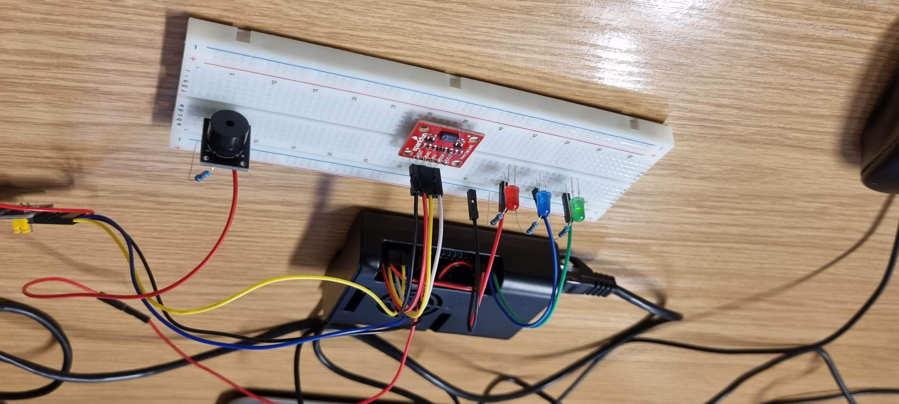
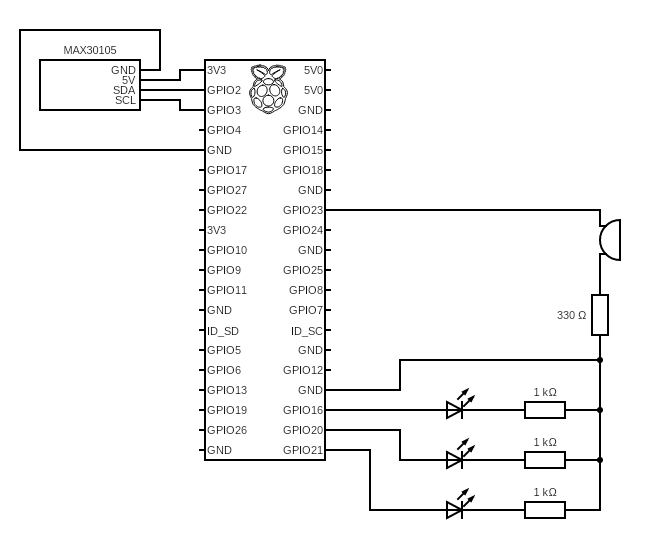
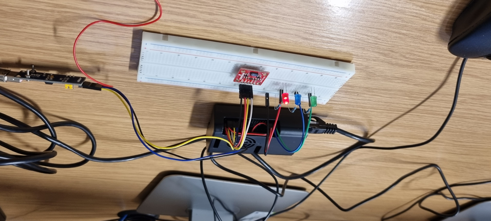
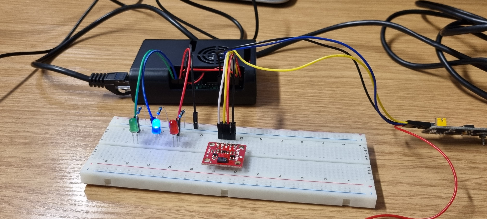

## SKPS21Z_mpalczuk_tkobylecki

# Dokumentacja projektowa
Mateusz Palczuk, Tymon Kobylecki

## Struktura katalogów
W pliku `dioda.py` znajduje się rozwiązanie zadania laboratoryjnego nr 2.
Polegało ono na implementacji sterowania diodą.
W naszym przypadku program ten wykonywał płynną zmianę jasności diody LED.
Pełna dokumentacja tego zadania najduje się w pliku [lab2.md](lab2.md).

W katalogu `buzzer_owrt_pkg` znajduje się pakiet **OpenWRT** zawierający program służący obsłudze buzzera w ramach zadania laboratoryjnego numer 3.
To zadanie polegało na generacji dźwięku, w naszym przypadku źródłem sygnału sterującego był nasz własny program ("pozytywka").
Ten sam kod znajduje się również w pliku `buzzer.c`.
Pełna dokumentacja tego zadania najduje się w pliku [lab3.md](lab3.md).

Ostatnim zadaniem jakie wykonaliśmy było wykonanie projektu.
Rozwiązanie tego zadania znajduje się w pliku `projekt.py`.
Pełna dokumentacja tego zadania najduje się poniżej.

## Opis projektu
Projekt miał na celu połączenie działania czujnika pulsu oraz efektorów w postaci trzech diod LED o różnych kolorach oraz buzzera pasywnego.
Po odczytaniu "zdrowej" wartości pulsu (tj. między 50 bpm a 130 bpm) zapalała się dioda czerwona.
Gdy wartość była bliska zeru ( $\leqslant$ 10 bpm), zapalała się zielona dioda, zaś w pozostałych przypadkach świeciła się dioda niebieska.
Po każdym pomyślnym odczytaniu wartości przez czujnik uruchamiany był buzzer pasywny, który wydawał dźwięk o częstotliwości zależnej od wartości odczytu.
Ostatni z tych elemetów miał za zadanie dać możliwość monitorowania wielu stanowisk pomiarowych na raz, na przykład w szpitalu, żeby pielęgniarka mogła nasłuchiwać sygnałów od wielu pacjentów i gdy usłyszy odpowiednio inny dźwięk mogła zareagować.

## Opis zastosowanych rozwiązań
W programie w języku Python wykorzystane zostały biblioteki `gpiod`, `multiprocessing`, `time` oraz `max30105`.
Ta pierwsza wykorzystana została w celu komunikacji z wyprowadzeniami GPIO.
Biblioteki `time` oraz `multiprocessing` posłużyły do obsługi buzzera pasywnego.
Pierwsza z nich została wykorzystana przy generacji programowego sygnału PWM przekazywanego do brzęczyka, zaś użycie drugiej pozwoliło na wykorzystanie wielu procesów w realizacji programu, dzięki czemu działanie buzzera nie zatrzymywało działania LEDów czy czujnika MAX30105.
Zostało w tym celu wybrane rozwiązanie wieloprocesowe, a nie np. wielowątkowe, ponieważ zapewniało ono ciągłość działania programu.
Było to kluczowe, gdyż programowa implementacja generacji sygnału PWM wiązała się z bardzo dużym zużyciem czasu procesora, co powodowało nieciągłą pracę systemu.
Komunikacja z procesem działającym w tle i generującym odpowiedni dźwięk przy pomocy programowej generacji fali PWM o odpowiednim wypełnieniu została przeprowadzona przy pomocy kolejki.
W niej każda wiadomość zawierała dwa pola.
Pierwsze było typu `bool` i zawierało wiadomość, czy ostatnio została odczytana nowa wartość tętna.
Kolejne pole natomiast zawierała wartość uderzeń na minutę (jeżeli ostatnio nie został zarejestrowany nowy odczyt to powielana była wartoścz poprzedniego dokonanego odczytu.

Biblioteka `max30105` z kolei pozwoliła nam na uproszczoną obsługę czujnika MAX30105.
Zdecydowaliśmy sie na wykorzystanie go, ponieważ czujnik ten komunikował sie poprzez protokół **I2C**.
Podjęliśmy próby samodzielnego ustanowienia komunikacji z czujnikiem przy użyciu tego protokołu, ale okazało się to wykraczać poza nasze możliwości.
Z tego też powodu nasza implementacja zakończyła się na etapie stworzenia programu w języku *Python*.

## Realizacja (sprzęt)
Wykorzystanym czujnikiem pulsu był wielofunkcyjny czujnik cząsteczek MAX30105.
Działa on na zasadzie świecenia na daną powierzchnię światłem z różnych diod i obserwacji światła odbitego.
Po analizie wyników można odczytac tętno, sprawdzić stężenie dymu w powietrzu i wiele innych ciekawych rzeczy.
Nasze użycie tego czujnika ograniczało sie jedynie do odczytu tętna badanego obiektu.

Całość projektu wyglądała następująco:

z widocznymi trzema diodami LED z lewej strony, buzzerem pasywnym po prawej oraz czujnikiem MAX30105 pośrodku.

Dokładny schemat połączeń został pokazany poniżej:

### Uwaga do realizacji sprzętowej
Jesteśmy świadomi, że podpięliśmy zasilanie czujnika opisanego jako 5V do wyprowadzenia 3.3V na komputerze jednopłytkowym *Raspberry Pi*.
Przed użyciem czujnika dużo czytaliśmy o nim na forach internetowych i dowiedzieliśmy się, że źle on (jak i *Raspberry PI*) znosi zasilanie ze źródła 5V.
Dowiedzieliśmy się również, że przez to nie będzie działać dioda zielona, ale ponieważ nas do odczytu tętna interesowały jedynia dioda czerwona i świata podczerwonego to postanowiliśmy zastosowac się do tej rekomendacji w obawie przed uszkodzneiem czujnika.

## Testy
<!-- TODO dokończyć testy -->
Testy przebiegały poprzez uruchomienie programu i przyłożenie palca żywego człowieka do czujnika MAX30105. Aby wywołać odczyty wykraczające poza "zdrowy" zakres, palec lekko odrywano, dzięki czemu czujnik nie potrafił zebrać poprawnego odczytu.

